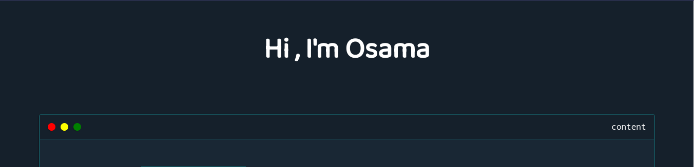

Developer, Content Creator, Dreamer And Ever So Ofetn A Human.

Full-Stack developer with +3 years of experience building web applications and servers with Javascript mainly.

    

 

## 📩 My latest Blogs and Stories

<!-- BLOG-POST-LIST:START -->

<a target="_blank" href="https://github-readme-medium-recent-article.vercel.app/medium/@osama1010/0">

<a target="_blank" href="https://github-readme-medium-recent-article.vercel.app/medium/@osama1010/0">

<!-- BLOG-POST-LIST:END -->

    

More Skills

   

   

> {office_quote}.
>
> {office_character}.
